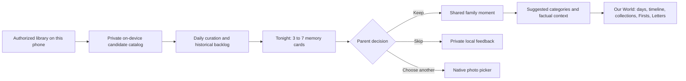

# Our Little World — Curated Memory Library Audit and Delivery Plan

Date: July 18, 2026
Status: locally complete on July 21, 2026. Releases 0–4, the shared-archive trust
stabilization slice, and final navigation/measurement/operations reconciliation are
implemented, simulator reviewed, tested, and committed. Production rollout and the
explicit physical-device gates remain external and were not performed.
Scope: Mobile product, on-device media discovery, shared family archive, Supabase data model, notifications, and release verification

## Implementation outcome

This document began as an audit. The diagnosis and target sections below preserve the
reasoning that shaped the work; the delivery statuses, implementation ledger, current
product state, architecture, sprint progress, and operations runbook record current
truth.

The missing center is now implemented locally: durable private candidate persistence,
a deterministic Tonight ritual, first-year catch-up, automatic factual collections,
grounded source-linked context, separately authored partner enrichment, conservative
post-Keep duplicate grouping, a single Today owner, and privacy-safe measurement.
Scene/activity labels remain deliberately gated because the existing heuristic is not
a validated visual model. This is a completed evidence-based product decision, not
unfinished scaffolding. The remaining work is production rollout proof, not another
local feature release.

## Executive decision

Our Little World has most of the technical ingredients for the intended product, but it does not yet assemble them into the parent experience.

The strongest current foundations are:

- on-device likely-child matching and quality scoring;
- day-first selection with one eligible anchor per day, additional distinct standouts, and special videos;
- lookalike suppression that keeps the best frame while preserving the originals;
- a shared, parent-approved family archive built from both parents' contributions;
- durable moments with photos, videos, text, voice, reactions, replies, Firsts, and Letters;
- a three-tab `Today` → `Add` → `Our World` navigation model;
- video upload, multi-frame matching, swipeable media detail, and native playback;
- a notification and `Tonight` scaffolding layer.

The missing center is a durable, paced review ritual. Today, scan candidates live primarily in the scan controller's in-memory state. A completed scan advances its checkpoint, and later incremental scans normally look back only three days. There is no durable local backlog that can reliably turn a 5,000-photo library into five calm review cards a night over several months.

The product should therefore be rebuilt around one promise:

> Each day, Our Little World quietly finds a few memories worth keeping. The parent confirms what belongs, adds as much or as little context as they want, and the family record organizes itself.

The next release should not add another collection of cards to Today. It should make `Tonight's memories` the primary ritual, persist the discovery backlog on device, and bring keep/skip, text, voice, emoji, suggested organization, and factual life context into one flow.

## Review scope and evidence

This review covered:

- the active product state and PRD;
- the primary routes and navigation shell;
- Today, Add, Our World, review, moment detail, Firsts, Letters, and onboarding flows;
- scan checkpoints, background/foreground ingestion, on-device matching, daily curation, lookalike suppression, video handling, and the local media database;
- the moments, media, voice, reactions, tags, Firsts, family-library, and notification schemas;
- current analytics contracts and test coverage;
- the physical-device review screenshots from build 1.1.0 (1.1.6), plus the subsequent identity-admission correction shipped in build 1.1.7.

The local Expo MCP session currently belongs to the Get Mentors project, not Our Little World, and the booted simulator is being used by that project. It was not disturbed for this audit. Product-flow findings are therefore grounded in source, tests, current product documentation, and the supplied physical-device evidence; a signed-in runtime walkthrough remains a required release gate for implementation.

No production data, deployment, or account state was changed during this audit.

## Where the product is now

| Product area | Current implementation | Readiness | What is still missing |
| --- | --- | --- | --- |
| Child identity | Native on-device face matching, age-diverse references, conservative consensus admission, review-first trust | Strong foundation | Large-library calibration and an ongoing false-positive quality dashboard |
| Best-photo selection | Quality ranking, true lookalike suppression, best-photo rails in Add/First/Letter | Strong foundation | Global event diversity, preference learning, and durable candidate history |
| Day-by-day curation | One eligible daily anchor, distinct standouts, special videos, honest gaps, 365-day saved view | Strong model | A durable unsaved day ledger and a parent-facing daily ritual |
| Historical catch-up | First scan can read from birth date; scan checkpoints support incremental follow-up | Incomplete | Persistent backlog, pacing, resurfacing, queue state, progress, and 5,000-photo scale proof |
| Nightly review | `tonightModel.js` ranks up to three links to existing surfaces | Placeholder | A real review session, media pager, enrichment controls, completion state, and scheduler |
| Photo review | Streaming grid, confidence filters, best-of-stack defaults, batch keep/skip | Useful utility | Calm one-at-a-time review, clear reasons, context, and crash-safe state |
| Text and voice | Add supports text and voice; moments and letters preserve audio | Strong primitives | Inline nightly annotation and separate authorship for both parents' context |
| Emoji and favorites | Moment reactions support emoji and co-parent activity | Partial | A clear “favorite/especially meaningful” signal that also informs curation |
| Categories and chapters | Manual moment tags, calendar-month grouping, Firsts, basic place/time/keyword labels | Early | Suggested categories, durable collections, confidence, parent corrections, and auto-filing |
| Life context | Stored birth date, moment date, age, places, linked Firsts, factual caption templates | Partial | A grounded context engine connecting memories to confirmed milestones and nearby events |
| Video | Multi-frame child presence, special-video selection, playable upload, full-screen playback | Strong foundation | Better video quality scoring, nightly presentation, seek/preview polish, and longer-form testing |
| Partner experience | Independent per-device libraries; saved union is shared; views, reactions, and replies | Correct architecture | One coherent review/enrichment experience, cross-parent saved-media dedupe, and shared context ownership |
| Notifications | Preferences, quiet hours, two-per-day cap, push delivery, `tonight_picks` category | Scaffolded | Actual nightly queue creation, correct deep link, family-local scheduling, and send eligibility |
| Measurement | Privacy-safe event contract and a few live event calls | Incomplete | Review funnel, false-positive, curation, enrichment, backlog, and time-saved instrumentation |

## The central diagnosis

### 1. The curation engine exists, but the backlog does not

`dailyCurationModel.js` already implements the right day-first principle. `scanController.js` can score a full library and select after all pages are complete. The problem is lifecycle and persistence:

- scan matches are stored in a singleton JavaScript state;
- the local SQLite database stores saved media, sync cursors, upload jobs, variants, and asset mappings, but not unsaved discovery candidates;
- review selection, expanded stacks, promoted alternatives, and skips are screen-local state;
- a completed scan writes a checkpoint even when candidates remain unreviewed;
- normal later scans begin at the more recent of the baby's birthday or the last checkpoint minus three days.

This is sufficient for “scan now and review now.” It cannot guarantee “show me the best 500 gradually over 100 evenings.” A terminated app can lose the active review set while its checkpoint makes most historical candidates ineligible for normal incremental scanning.

This is the P0 engineering problem.

### 2. Today is a dashboard, not yet a ritual

Today currently combines:

- a primary assistant nudge;
- a daily prompt;
- a weekly digest;
- a compact Tonight section containing links to other screens;
- a milestone card;
- a recent timeline;
- month sections;
- Places and On This Day segments.

Many of these features are individually useful, but together they compete for attention and duplicate Our World. A tired parent should not have to choose which subsystem to operate. Today should answer one question: “What is worth a minute tonight?”

### 3. Review still feels like photo administration

The current grid is effective for debugging and bulk correction. It is not the intended emotional experience. It asks the parent to inspect a dense camera-roll-like grid, interpret confidence groups, manage selection, and then save a batch.

The target is a short media pager that explains the app's work:

- “Best of 14 similar shots”;
- “One clear photo for July 17”;
- “Distinct from the other smile at 4:12 PM”;
- “Special video · Reuben appears across most sampled frames.”

The parent should confirm, enrich, or swipe away—not perform curation from scratch.

### 4. “AI organization” is not implemented yet

The current `visionSceneLabeler.js` is a safe heuristic layer. It uses capture time, location clusters, and parent-written keywords. It is not visual scene understanding. The native matcher identifies the likely child and exposes quality signals; it does not currently recognize activities, objects, routines, people relationships, or validated expressions.

Today, categories are mainly:

- manually entered tags;
- calendar months;
- Firsts;
- basic place clusters;
- time-of-day labels;
- keyword-derived labels from text already written by a parent.

That is a good trust-safe baseline, but it does not yet do the organizing for parents.

### 5. Enrichment capabilities are fragmented

The app can already save text, voice, emoji reactions, replies, Firsts, dates, places, and tags. The missing work is orchestration:

- review cannot add context before or during the keep decision;
- Add and Moment Detail expose optional context through separate forms;
- tags are manual free text;
- partner replies and moment captions represent different authorship models;
- voice is attached to a moment, but there is no nightly inline recording experience;
- favorites are represented indirectly through reactions, not as an explicit curation signal.

The new ritual should reuse these primitives while reducing the number of screens and save buttons.

### 6. The two-parent privacy model is right

The app should not mirror either parent's camera roll to the cloud. The current production contract is the correct one:

- each parent authorizes and scans only their own device library;
- unsaved candidates, asset identifiers, face embeddings, fingerprints, and rejects remain local;
- the shared archive is the union of kept memories;
- both parents can enrich kept memories;
- aggregate library connection health may be shared, but private library contents may not.

The target experience can feel like one family album without building a shared surveillance database of both camera rolls.

### 7. Developmental context must be factual

The app can safely say:

- the photo's date;
- the baby's computed age on that date;
- a stored place;
- a parent-confirmed First and its date;
- the date distance between two confirmed events;
- that two saved photos occurred near each other in time.

It must not infer that a baby “first smiled,” “started solids,” loved an activity, felt happy, or reached a milestone from an image alone.

The correct copy is:

> July 17 · 11 months, 25 days. Taken 18 days after the First “smiled at us” that you saved.

Not:

> Reuben had recently learned to smile.

The first sentence is computed from parent-confirmed facts. The second turns an interpretation into family history.

## Target product model

### The core loop

### Product principles

1. **The app curates; the parent confirms.** Defaults should already be sensible.
2. **A few good memories beat a large review queue.** Never fill a quota with weak media.
3. **One per eligible day is a floor, not a cap.** Distinct standouts and special videos survive.
4. **Top 500 is a target shape, not a destructive limit.** For a first year, 365 daily anchors plus roughly 100–200 standouts and videos is a useful starting band, but the family's actual media decides.
5. **Context is optional; organization is automatic.** The parent should not need to file every item.
6. **Suggestions are reversible.** Every category, caption, First link, and favorite can be corrected.
7. **Private before saved; shared after kept.** Unsaved camera-roll analysis remains on device.
8. **No invented family history.** Generated copy may compose facts, not manufacture meaning.

## Target parent journeys

### A new parent with a large existing library

1. Add the baby's name and birth date.
2. Allow full or limited Photos access.
3. The app analyzes a bounded birth-to-present sample and proposes one strong representative photo.
4. The parent confirms “This is Reuben” or chooses another photo.
5. The app scans the most recent seven days first so useful memories appear quickly.
6. The full historical catalog builds privately in the background with clear battery/iCloud handling.
7. The first Tonight session contains three to five high-confidence items, not hundreds.
8. Historical catch-up continues over time without requiring another full-grid review.

### The nightly ritual

1. At the parent's chosen time, notify only if a queue exists: “Five memories are ready for tonight.”
2. Open directly into a full-screen media card.
3. Show date, age, media reason, and why it was selected.
4. Preselect suggested categories and the keep decision when trust permits.
5. Offer persistent, lightweight controls:
   - keep or skip;
   - heart/favorite or another emoji;
   - one-line text;
   - hold or tap to record voice;
   - suggested category chips;
   - “Choose another” native picker.
6. Auto-save drafts locally and commit safely as the parent advances.
7. Finish with “That's tonight. Five kept close.” No streak and no guilt.

The default session should contain three to seven cards. “Keep going” can open more, but a nightly ritual should not default to the older 20-item feed concept.

### Historical catch-up

The queue should mix:

- daily coverage gaps with a strong eligible anchor;
- high-quality distinct standouts;
- special videos;
- older days near a confirmed First or meaningful parent-authored event;
- occasional deep cuts that have never been reviewed.

A parent reviewing five items per active evening can process about 500 candidates in 100 sessions. The system should accelerate by auto-keeping only after identity trust is earned and the parent explicitly enables it. Even then, Tonight should make correction and context easy.

### Our World

Our World should open as a visual family record, not a menu of feature types.

Recommended information architecture:

1. **Days** — first-year coverage and day-by-day browsing.
2. **Timeline** — event-first stream of saved photos, videos, notes, and voice.
3. **Collections** — automatically organized groups such as Big smiles, Bath time, With Mama, At home, Videos, Favorites, Firsts, and family-created collections.

Firsts and Letters remain prominent durable collections. Search, Places, export, and printing remain secondary utilities. Today should no longer repeat the full recent timeline, month grid, and Places navigation.

### The partner experience

The production rule should be easy to explain:

> Discovery is private to each phone. Memories become shared when a parent keeps them.

The implementation should support two kinds of nightly cards:

- **From your phone:** a private candidate only that parent can see until kept;
- **In your world:** a saved memory either parent can annotate, react to, or revisit.

If both parents keep the same photo or video, the server should detect likely duplicate uploads using privacy-safe post-save fingerprints and group them as one event presentation. It should not silently delete either parent's contribution or merge away their authored context.

## Curation policy

### Eligibility

A candidate must pass:

- the likely-child identity admission boundary;
- minimum usable-media quality;
- a valid capture date on or after birth;
- media availability or an explicit iCloud-wait state;
- duplicate and previously-reviewed checks.

Uncertain identity candidates may appear only in an optional correction lane, never as default nightly keeps.

### Daily selection

For each local calendar day:

1. Choose one strongest eligible photo as the daily anchor.
2. Keep additional photos only when visually distinct and independently strong.
3. Keep every qualifying special video; do not force an arbitrary daily cap.
4. Prefer event diversity across time, place, composition, people, and activity signals.
5. Keep an honest gap if there is no eligible baby media.

### Queue shaping

Starting nightly mix:

- two or three recent items from the last 48 hours;
- two or three historical coverage or standout items;
- at least one video when a strong unreviewed video is available;
- no repeat of a candidate already kept, skipped, or shown too recently;
- no padding below the quality floor.

These are tunable distribution rules, not product claims.

### Explainability

Every card should expose one parent-readable reason from a fixed allowlist:

- Best photo from this day
- Best of a similar burst
- Distinct standout
- Clear video with your baby throughout
- Fills a day in the first year
- Near a First you confirmed
- You or your partner favorited a related moment

Raw similarity scores, embeddings, confidence percentages, and model jargon stay out of the parent interface.

## Automatic organization

### Collection types

Collections should be generated from evidence in descending trust order:

1. **Facts:** date, age, month, year, media type, author, confirmed First.
2. **Device metadata:** place cluster, time of day, burst/event grouping.
3. **Parent behavior:** favorites, reactions, kept/skipped choices, edited categories.
4. **Validated on-device visual signals:** scene, objects, activity, composition, and expression only after quality evaluation.
5. **Server enrichment of already-kept media:** optional and explicit; never upload unsaved candidates for remote analysis.

Initial suggested collections:

- First 365 days
- Favorites
- Videos
- With Mama / With Papa / With family, only after those people are parent-labeled
- At home
- Bath time
- Bedtime
- Out and about
- Big expressions, only after expression quality is validated and copy avoids emotion claims
- Firsts
- Monthly and seasonal collections

### Parent interaction

Suggested categories should arrive selected. The parent can remove or replace them, but should not need to open a filing screen. Corrections should improve future category ranking for that family without crossing into child-identity feedback.

### Chapter model

“Chapter” should be a presentation concept, not required manual labor. The app can create:

- Month 1, Month 2, and first-year time chapters;
- a chapter around a confirmed First;
- recurring-routine collections after enough evidence;
- parent-created named collections when desired.

The parent may move a memory, but the normal state is already organized.

## Grounded memory context

Build a factual context graph from:

- the baby's birth date;
- moment capture dates;
- parent-confirmed Firsts and their dates;
- letters, prompts, notes, and places with explicit dates;
- family-authored titles and tags;
- saved event clusters.

The context composer may produce statements such as:

- “Day 183 · six months old.”
- “Taken at home on a Sunday morning.”
- “Twelve days after the First ‘rolled over’ that you saved.”
- “Another bath-time memory from the same month.”

It must not produce:

- an unconfirmed First;
- an exact developmental claim based only on an age norm;
- a child's emotion, preference, or intent;
- a relationship label that the family did not provide;
- a place derived from hidden raw coordinates when no safe label exists.

## Data and architecture changes

### Private on-device candidate catalog

Extend the local SQLite database with family-and-user-scoped tables.

`discovery_candidates`

- family ID and user ID;
- normalized local asset ID;
- capture date, media type, duration, dimensions, and iCloud state;
- identity admission band and quality features;
- perceptual fingerprint or local feature reference;
- day key and event-cluster key;
- curation role and reason;
- state: discovered, queued, shown, kept, skipped, unavailable;
- first seen, last shown, decision time, and model version.

`candidate_clusters`

- burst/event cluster ID;
- representative asset ID;
- member count;
- distinctness and event metadata;
- model version.

`review_queue_items`

- local session ID and queue date;
- candidate ID;
- rank, lane, reason, and state;
- draft text, draft category changes, and draft favorite/reaction;
- retry and commit state.

`candidate_feedback`

- decision type and reason;
- the assistant loop it may affect;
- no raw private content in analytics.

The scan checkpoint must advance independently from review state. “Scanned” may mean analyzed; it must never mean reviewed.

### Shared server data

Reuse:

- `moments` and `moment_media` for kept memories;
- `voice_notes` for audio;
- `moment_reactions` for emoji;
- `moment_tags` during migration;
- `firsts`, `letters`, views, and replies.

Add:

- `memory_collections` — family-owned automatic or parent-created collection metadata;
- `memory_collection_items` — moment membership, source, confidence band, and parent override;
- `moment_annotations` — separately authored text or voice context from either writer, instead of overwriting one canonical caption;
- optional `moment_context_facts` only for stored, source-linked factual relationships that are expensive to recompute;
- post-save duplicate/event grouping metadata that never contains another parent's local asset ID.

### AI boundary

- Child identity, quality, duplicate suppression, and unsaved candidate classification should remain on device.
- Remote AI may analyze only parent-kept media, behind an explicit product policy and deletion/export path.
- A compact on-device model is preferable for scene/activity suggestions when accuracy is adequate.
- Every model output needs a version, confidence band, source, and reversible parent override.
- A correction must affect only the relevant loop: category correction must not become face-identity feedback; First dismissal must not become a photo rejection.

## Navigation and flow changes

### Keep

- Three bottom actions: Today, Add, Our World.
- Add's intention chooser.
- Firsts and Letters as durable collections.
- Native picker as the escape hatch.
- Export and print as secondary utilities.

### Change

- Make `/timeline` the single canonical Today route; remove duplicate root/Today ownership after migration.
- Replace the current Tonight link list with one queue card and a dedicated `/tonight` route.
- Move Timeline, month browsing, Places, and On This Day out of Today and into Our World.
- Make Our World default to the visual day/timeline experience before feature cards.
- Put suggested categories and enrichment directly in the Tonight pager.
- Deep-link `tonight_picks` to `/tonight`, not `/digest`.

### Remove or demote

- Hardcoded “A Mother's Day gift” partner reveal copy outside a true gift context.
- Book-readiness nudges from the primary Today queue.
- Camera-roll tools and export language from the main Our World path.
- Dense confidence-filter review as the default parent experience; keep it as an advanced correction utility.
- Any requirement that parents manually create or maintain chapters.

## Delivery sequence

### Release 0 — Trustworthy backlog and product cut

Goal: make the desired product technically possible before redesigning the surface.

Status: complete locally on July 18, 2026. The private ledger, independent scan and
review progress, deterministic queue, protected Tonight slice, migration/restart
proof, and 5,000-candidate performance fixture were implemented in commit `b70ecc5`.

Build:

- persistent candidate, cluster, decision, and queue tables in `mediaDb.js`;
- candidate upsert during scan instead of scan-state-only storage;
- separate scanned/analyzed checkpoint from reviewed state;
- crash-safe keep/skip and queue drafts;
- a deterministic 5,000-item fixture and resume tests;
- privacy-safe review funnel analytics;
- remove the Mother's Day artifact and remaining primary-flow book-readiness nudges;
- simplify Today so the future queue has one obvious home.

Acceptance:

- terminate and relaunch during a 5,000-photo scan without losing candidates or decisions;
- finish a scan, wait seven days, and still surface unreviewed birth-month candidates;
- no unsaved asset ID, fingerprint, or face data leaves the device;
- a checkpoint cannot make an unreviewed historical candidate unreachable.

### Release 1 — Tonight's memories MVP

Goal: deliver the parent experience in the user's description.

Status: complete locally on July 20, 2026. Inline text, voice, favorite/reaction,
bounded best-of-burst correction, draft-safe idempotent Keep, queue-aware local
notification readiness, and the full completion/resume flow are implemented. No
remote migration, production notification, deploy, push, or store submission occurred.

Build:

- `/tonight` full-screen photo/video pager;
- three-to-seven-card daily queue from recent and historical candidates;
- clear selection reasons and best-of-burst expansion;
- keep, skip, choose another, favorite/emoji, one-line note, and voice controls;
- local autosave for drafts and idempotent commit into shared moments;
- notification scheduling and `/tonight` deep link;
- end card and completion state;
- advanced grid review retained behind “Review more.”

Acceptance:

- a parent can complete five cards without visiting Add, Review, or Moment Detail;
- adding one line or a voice note requires no separate form;
- a strong video plays inline and full-screen;
- uncertain identity candidates are not preselected;
- the session survives backgrounding, app termination, and intermittent network access.

### Release 2 — First-year catch-up engine

Goal: turn a large existing library into a paced first-year record.

Status: complete locally on July 20, 2026. Stable family-timezone daily anchors,
adaptive three/five/seven-card pacing, bounded Keep going, changed-library and
unavailable-asset reconciliation, battery-aware discovery, family-union saved-day
coverage, truthful target-band progress, a virtualized 365-day album, and same-day
standout browsing are implemented. Lapsed families retain browse-only archive access
while Add, scanning, queues, and writes remain unavailable. No remote migration,
production data action, deploy, push, or store submission occurred.

Build:

- coverage-aware ranking across every day since birth;
- event diversity and standout scoring;
- one strong video whenever available without forcing a weak video;
- adaptive daily pace and “Keep going”;
- progress framed as memories found, never a guilt-inducing streak;
- iCloud, limited-library, changed-library, deletion, and battery-aware handling;
- first-year target-band reporting rather than a hard 500 cap.

Acceptance:

- a 5,000-item fixture produces stable day anchors and distinct standouts regardless of scan order;
- the queue does not repeat kept/skipped/recently-shown candidates;
- historical coverage grows over repeated sessions without rescanning the entire library;
- missing days remain honest gaps;
- 365-day browsing remains performant with at least 5,000 saved moments.

### Release 3 — Automatic collections

Prerequisite status: complete locally on July 20, 2026. A narrow shared-archive trust
slice was inserted because collection membership cannot safely reference raw device
Photos identifiers, accept lapsed writes, or disappear when one author's account is
removed. New Keeps now use device-private opaque identity mappings and stable retry
targets; shared metadata is scrubbed; server policies enforce active writers; and
family-owned authored records survive account deletion with removed attribution.
The remote migrations are locally replayed and tested but deliberately not deployed.
Legacy-row rotation requires a staged production rollout after compatible clients are
adopted so older installed builds do not create duplicate Keeps; that external rollout
gate does not block local Release 3 implementation.

Status: complete locally on July 20, 2026. Durable family-owned factual collections,
selected-by-default Tonight filing suggestions, reversible parent corrections, the
Our World Collections surface, collection-backed search, bounded paging, source and
model provenance, active-writer mutation gates, Circle privacy, and 5,000-saved-memory
performance proof are implemented. Date, media, author, confirmed First, parent place,
favorite/reaction, and first-year facts organize kept memories without any required
filing action. Visual scene/activity suggestions were deliberately not enabled: the
existing heuristic is not a validated visual classifier, and shipping speculative
labels would violate the trust goal. The documented evidence-based fallback is the
complete factual collection set until a future on-device evaluation clears that gate.
No remote migration, deploy, push, production write, or store action occurred.

Goal: organize the family record with minimal parent work.

Build:

- collection schema and Our World collection surface;
- automatic date, media, First, author, place, and behavior collections;
- validated on-device scene/activity suggestions, or an explicit evidence-based gate
  retaining factual fallbacks when validation is insufficient;
- selected-by-default category chips in Tonight;
- category correction learning isolated from identity learning;
- search and filters backed by collection membership.

Acceptance:

- every kept item is useful in at least one automatic factual collection;
- most items have zero required organization actions;
- a correction updates the shared collection without rewriting parent-authored context;
- model confidence and source are inspectable internally and never shown as raw scores to parents.

### Release 4 — Grounded life context and shared enrichment

Goal: help parents remember when a moment happened in the baby's life without inventing history.

Status: complete locally on July 21, 2026. Source-linked date, age, safe parent
place, confirmed-First adjacency, separately authored parent text/voice, bounded
already-kept Tonight lookbacks, and exact post-Keep duplicate grouping are implemented.
Changing or deleting a source invalidates dependent facts; grouping preserves both
parents' originals and words. Unsaved candidates remain private to their originating
device. Circle sees annotations only on explicitly selected moments and cannot write;
lapsed writers retain read-only access. Archive export includes separate contributions
and automatic collections. All migrations were replayed and tested only against the
disposable local Supabase stack; nothing was pushed, deployed, submitted, or changed
in production.

Build:

- source-linked context graph;
- deterministic date-distance copy around confirmed Firsts and parent-authored events;
- partner-specific text/voice annotations;
- shared Tonight lookbacks from already-kept memories;
- duplicate/event presentation for two parents keeping the same media;
- richer video previews and playback polish.

Acceptance:

- every developmental statement links to a confirmed source record;
- deleting or changing a First invalidates dependent context copy;
- both parents can add separate context without overwriting each other;
- no unsaved candidate from one parent's phone is visible to the other;
- shared duplicate grouping preserves both parents' authorship and originals.

## Implementation ledger by priority

| Priority | Epic | Status | Evidence / decision |
| --- | --- | --- | --- |
| P0 | Durable candidate ledger | Simulator verified | SQLite schema v3 foundation; restart, checkpoint independence, overlapping scan, migration, privacy, and 5,000-item tests |
| P0 | Queue engine | Simulator verified | Deterministic quality-bounded 0–7 queue, fixed reasons, no-repeat lifecycle, transactional resume |
| P0 | Tonight route and UI | Simulator verified | Photo/video pager, Keep/Skip, picker, error/retry, completion, resume, and advanced Review escape |
| P0 | Trust and identity regression suite | Implemented | Consensus admission, unrelated-face, polluted-reference, uncertain/default, skip/calibration, and identity/duplicate-separation regressions |
| P1 | Inline text/voice/emoji | Simulator verified | Private writer drafts, canonical idempotent enrichment, cleanup, permission/interruption/retry proof |
| P1 | Historical catch-up ranking | Simulator verified | Stable family-timezone anchors, standouts, videos, adaptive pacing, Keep going, library reconciliation, truthful 365 days |
| P1 | Nightly notifications | Implemented; physical delivery gate external | Real-queue local scheduler, DST/quiet-hour/cap/deep-link tests; remote cadence refuses device-private Tonight readiness |
| P1 | Navigation cut | Simulator verified | One Today owner, one Our World archive owner, no primary print/book nudge, Review remains advanced |
| P2 | Automatic collections | Simulator verified | Family-owned factual derivation, selected defaults, reversible corrections, provenance, search and bounded paging |
| P2 | Visual suggestion model | Deliberately deferred with evidence | Existing heuristic is not validated visual understanding; factual collections are the safe complete fallback |
| P2 | Factual context graph | Simulator verified | Date/age/place/confirmed-First sources, trigger invalidation, no fabricated development claims |
| P2 | Partner duplicate grouping | Simulator verified | Exact post-Keep grouping, sanitized bounded reads, both originals/authors preserved |
| P2 | Measurement and operations | Implemented; production observation external | Consent-gated coarse events, notification boundary, dashboards/alerts/rollout/rollback runbook; no private content fields |

## Success metrics

### Parent-value metrics

- time from signup to first relevant memory kept;
- nightly notification-to-open rate when a queue exists;
- Tonight completion rate;
- median seconds per reviewed memory;
- percent of sessions completed with one-tap defaults;
- keep rate for default-selected candidates;
- text, voice, and reaction enrichment rate;
- first-year eligible-day coverage over time;
- distinct standout and special-video keep rate;
- video play and completion rate;
- partner open, reaction, reply, and annotation rate.

### Trust guardrails

- unrelated-person rate among clear/default candidates;
- parent skip rate by identity confidence band;
- duplicate leakage rate;
- parent reversal rate after auto-save;
- unavailable/iCloud candidate rate;
- upload and playable-video failure rate;
- queue repeat rate;
- scan battery, memory, thermal, and duration bands;
- privacy payload audits for local asset IDs, face data, text, audio transcripts, and media URLs.

The primary product metric should be **meaningful memories kept with minimal parent effort**, not total photos imported and not book-ready pages.

## Verification plan

### Deterministic families

Maintain fixtures for:

- empty/new family;
- first scan awaiting identity confirmation;
- active family with one year and 5,000 local assets;
- repeated 14-shot bursts;
- several distinct high-quality photos on one day;
- no-photo gap days;
- multiple strong videos and poster-only fallback;
- limited Photos permission and iCloud-only originals;
- changed and deleted local assets;
- two parents with overlapping and non-overlapping libraries;
- confirmed, corrected, and deleted Firsts;
- lapsed subscription, export, and deletion behavior;
- light/dark appearance and supported phone sizes.

### Automated gates

- pure-model tests for ranking, daily coverage, queue shaping, reason codes, and context truth;
- SQLite migration and restart tests;
- 5,000-item performance and memory test;
- Supabase migration/RLS tests for collections and annotations;
- edge-function tests for family-local nightly scheduling, quiet hours, and deep links;
- Maestro flows for onboarding, Tonight completion, voice, video, partner sync, and crash/relaunch resume;
- mobile test, lint, typecheck, and signed iOS build gates.

### Physical-device gates

Before release:

- test against Jesse's real large library on build 1.1.7 or later;
- compare false positives, daily anchors, standouts, videos, and queue stability across at least seven captured days;
- verify background scanning, Low Power Mode, iCloud waits, and notification timing;
- run one real two-parent contribution/enrichment loop;
- inspect actual photos and videos, not only counters and receipts.

## Decisions to hold

- Do not upload or mirror either parent's whole camera roll.
- Do not make parents manually file every memory into chapters.
- Do not use a fixed top-500 deletion cap.
- Do not auto-create Firsts from image inference.
- Do not make printing, book readiness, or export a daily nudge.
- Do not default to a 20-item nightly feed.
- Do not expose uncertain matches in the normal keep lane.
- Do not call time/keyword heuristics “AI vision” in product claims.
- Do not let category feedback alter child-identity matching.

## Next action: controlled production-readiness proof

No additional local product slice is required by this plan. Follow
`docs/curated-memory-operations.md` and keep the release boundaries separate:

1. compatible-client and legacy-identifier adoption gate;
2. non-production migration/RLS/export/deletion rehearsal;
3. signed-build synthetic and two-writer proof;
4. seven-day physical-device large-library, iCloud, Low Power Mode, notification,
   video, and false-positive validation;
5. explicitly authorized staged production migrations, services, build, and rollout.

Production migrations, deployment, notification delivery, TestFlight/App Store work,
and real-account mutation were not authorized or performed during this program.
